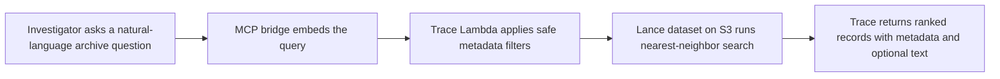

# Trace

Trace is an AI-assisted investigation workflow for cold archives. It helps
compliance and trust teams find, explain, and hand off the right evidence fast
even when exact keywords do not match.

Trace is purpose-built for one primary workflow: high-stakes archive review
across historical incidents, audits, and compliance records where language is
inconsistent but operational constraints still matter.

## Problem / User / Why Existing Search Fails / Why Trace

### Problem

Archived incident records are hard to turn into a defensible answer. The right
record may describe the same issue using different language, while
keyword-overlapping records can still be the wrong operational match.

### User

Trace is designed for a regulatory, compliance, or trust and safety
investigator who needs to answer questions like:

- Have we seen a related incident before?
- Are there matching cases in this city or document category?
- Which archived records are relevant enough to support an audit, regulator
  response, or internal escalation?
- Can I hand another team a defensible evidence packet instead of a loose list
  of search hits?

The primary persona is documented in
[docs/PERSONA.md](C:/Users/matth/Projects/Trace/Trace/docs/PERSONA.md).

### Why Existing Search Fails

- Keyword search is too brittle when prior records use different wording.
- Broad semantic search alone can still be too noisy for real investigations.
- Archive users need both flexible retrieval and strict operational narrowing.

### Why Trace

Trace combines semantic retrieval with constrained metadata filtering over
`city_code`, `doc_type`, `timestamp`, and `incident_id`. That lets
investigators start from a natural-language case request, tighten results to
the jurisdiction, document class, and time window that matter, and move toward
an explainable handoff instead of a generic search result page.

## Proof Of Value

The committed Step 3 proof pack lives in
[docs/PROOF_OF_VALUE.md](C:/Users/matth/Projects/Trace/Trace/docs/PROOF_OF_VALUE.md).
It packages two selected local comparison artifacts from the retrieval harness:

- for the insurance lapse workflow, `keyword_only` returned `0/3` labeled positives while Trace returned `3/3`
- for the Chicago insurance-scope workflow, semantic-only retrieval kept `3/3` labeled positives but only `3/5` top rows stayed in scope, while Trace kept `5/5` in scope

Those two artifacts are the approved side-by-side comparisons for the README,
demo, and pitch. They are local retrieval evidence from the current eval corpus,
not proof of deployed-path equivalence or a broad benchmark. The same local
report also evaluates `vector_postfilter`; on the current labeled corpus it
matches `trace_prefilter_vector`, so the proof pack is intentionally showing two
selected failure modes rather than claiming that every non-Trace baseline loses.

## Evidence

The canonical Step 4 evidence pack lives in
[docs/BENCHMARK_EVIDENCE.md](C:/Users/matth/Projects/Trace/Trace/docs/BENCHMARK_EVIDENCE.md).
Use that doc and
[fixtures/eval/benchmark_evidence_snapshot.json](C:/Users/matth/Projects/Trace/Trace/fixtures/eval/benchmark_evidence_snapshot.json)
for README, demo, and pitch-safe numbers.

- Trace reached `1.000` average `Recall@k` and `1.000` filtered strict accuracy on the current labeled eval corpus.
- `keyword_only` lagged at `0.250` average `Recall@k`, `0.150` average `Precision@k`, and `0.000` filtered strict accuracy on that same corpus.
- the deployed `trace-eval` benchmark artifact now records warm HTTP median latency of `187.761` ms, median reported `took_ms` of `92.000` ms, direct-Lambda cold-sample median `Init Duration` of `97.480` ms plus median billed duration of `1728.000` ms, and estimated warm search-runtime cost of `0.00000164` USD/query

## At A Glance

The current repository contains:

- a production web app in `demo-ui/`
- a Node app API plus MCP bridge runtime in `mcp-bridge/`
- a Rust Lambda search engine in `lambda-engine/`
- a Python seeding pipeline in `scripts/`
- a deployed proof runner and MCP stdio helper in `scripts/`
- an AWS SAM template in `template.yaml`

The current implementation supports Lance-backed nearest-neighbor search,
constrained metadata filtering, API key or IAM-only HTTP access, and an MCP
bridge that embeds natural-language queries before calling the search API.

## How Trace Works



Trace is not generic search infrastructure. It is an investigation workflow
that balances semantic flexibility with structured control so operators can
reach a defensible decision faster.

## Production app architecture

The production app adds a browser-facing investigation surface on top of the
existing search stack:

- `demo-ui/` builds the static SPA that investigators use.
- `mcp-bridge/` now serves two roles: the existing stdio MCP bridge and the
  public app API Lambda runtime.
- The public app API is exposed under `/api/*` and owns embedding generation,
  typed filter handling, and result shaping for the frontend.
- The app API now resolves its OpenAI and optional Trace API secrets at Lambda
  runtime from Secrets Manager metadata env vars rather than asking
  CloudFormation to inject plaintext secrets directly.
- The Rust Lambda in `lambda-engine/` remains the search engine behind
  `POST /search`.

The browser should talk only to the app API. OpenAI credentials and any Trace
search API key stay server-side in the Node app API.

## Repository layout

- `demo-ui/`: static React/Vite frontend for the production investigation app
- `lambda-engine/`: Rust Lambda runtime, request validation, filtering, and Lance search path
- `mcp-bridge/`: shared Node layer for the stdio MCP bridge and the app API Lambda
- `scripts/`: synthetic dataset generation and optional S3 upload/promotion flow
- `docs/`: active reference docs plus a `deprecated/` archive for superseded planning material
- `template.yaml`: SAM deployment template for the Lambda and HTTP API

## Run the production app locally

The currently supported local browser workflow is:

1. Use a deployed Trace app base URL for the app API origin. Read
   `AppApiBaseUrl` from the deployed stack outputs and set
   `VITE_TRACE_API_BASE_URL` to that origin only, without an added `/api`
   suffix. The frontend app appends `/api/search`, `/api/cases`, and
   `/api/health` itself.

2. Run the frontend locally with Vite:

```bash
set VITE_TRACE_API_BASE_URL=https://<cloudfront-domain>
cd demo-ui
npm install
npm run dev
```

3. For app API changes, validate the Node code and the deploy packaging path
   separately. `sam build` now packages the app API directly from
   `mcp-bridge/src/app-api.ts` as a CommonJS Lambda bundle, but AWS SAM's
   `NodejsNpmEsbuildBuilder` requires `esbuild` on the host machine first:

```bash
npm install --global esbuild
cd mcp-bridge
npm install
npm test
cd ..
sam build --beta-features
```

`sam local start-api` is not the supported `/api/*` workflow for this branch.
The public app API routes are created with explicit API Gateway v2 integration
resources, and the deployed `/api/*` shape also depends on the CloudFront
distribution in `template.yaml`. Use a deployed stack for browser-level `/api/*`
testing, and use `npm test` plus `sam build --beta-features` to validate app
API code changes locally.

## Deploy the production app

`template.yaml` provisions the frontend bucket, CloudFront distribution, Rust
search Lambda, and Node app API, but the SPA publish step is still explicit:
build `demo-ui/`, sync `demo-ui/dist` to the provisioned S3 bucket, and then
invalidate CloudFront so the new assets go live.

1. Build and deploy the stack. Install `esbuild` once on the deployment
   machine, then run SAM. `sam build --beta-features` packages both the Rust
   Lambda and the Node app API from source, so a pre-existing
   `mcp-bridge/dist/` directory is not required:

```bash
npm install --global esbuild
sam build --beta-features
sam deploy --stack-name <stack-name> --region <region> --capabilities CAPABILITY_IAM --resolve-s3
```

2. Read these stack outputs:

- `AppUrl`: investigator-facing CloudFront URL
- `AppApiBaseUrl`: value to use for `VITE_TRACE_API_BASE_URL`
- `FrontendBucketName` or `FrontendPublishS3Uri`: publish target for `demo-ui/dist`
- `TraceAppDistributionId`: CloudFront distribution ID for invalidation

3. Build the SPA against the deployed CloudFront origin. Do not append `/api`
   to `VITE_TRACE_API_BASE_URL`:

```bash
set VITE_TRACE_API_BASE_URL=https://<cloudfront-domain>
cd demo-ui
npm install
npm run build
```

4. Publish the built SPA and invalidate CloudFront:

```bash
aws s3 sync demo-ui/dist s3://<frontend-bucket-name>/ --delete
aws cloudfront create-invalidation --distribution-id <distribution-id> --paths "/*"
```

If you skip the sync and invalidation step, the deployed stack has working
infra but no updated frontend artifact.

For the current one-command PowerShell deploy helpers and the web app update
workflow, see
[docs/WEB_APP_DEPLOYMENT.md](C:/Users/matth/Projects/Trace/Trace/docs/WEB_APP_DEPLOYMENT.md).
That guide also documents the current plain-text OpenAI secret convention and
the built-in post-deploy `/api/search` smoke check.

## Quick start

### 1. Seed a local dataset

`scripts/seed.py` now generates a deterministic synthetic source corpus, writes
`<output_dir>/<table>.source.parquet` and
`<output_dir>/<table>.seed-manifest.json`, and supports two explicit vector
modes:

- `openai` (default): real embeddings for eval/demo datasets
- `random`: deterministic smoke/infra vectors only

Install Python dependencies:

```bash
pip install -r scripts/requirements.txt -c scripts/constraints.txt
```

Generate a small random-vector smoke dataset:

```bash
python scripts/seed.py --embedding-mode random --rows 2000 --output-dir _smoke_lance_seed --force
```

Generate the default embedding-backed local dataset:

```bash
set OPENAI_API_KEY=...
python scripts/seed.py --force
```

The default run uses `text-embedding-3-small` and keeps the dataset at 1536
dimensions to match the current Lambda and MCP bridge expectations.

Validate the embedding-backed local eval dataset before upload:

```bash
set OPENAI_API_KEY=...
python scripts/validate_eval_dataset.py --output-dir lance_seed --table-name uber_audit
```

That command runs a small curated set of local query and filtered-query sanity
cases from `fixtures/eval/local_validation_cases.json`, writes
`<output_dir>/<table>.eval-validation.json`, and records the latest validation
summary back into the seed manifest for auditability before S3 promotion. The
current validator is a local gate for an `openai` manifest, manifest/query
model alignment, `1536`-dimension consistency, the repo's restricted
`sql_filter` syntax, and a few expected retrieval patterns; it is not a full
relevance harness, benchmark corpus, or proof of deployed-path equivalence.

Run the local retrieval relevance harness:

```bash
set OPENAI_API_KEY=...
python scripts/evaluate_retrieval.py --output-dir .test-tmp/eval-seed --table-name uber_audit --cases-path fixtures/eval/retrieval_relevance_cases.json
```

That command scores three local methods on a small labeled corpus:

- the harness's local `trace_prefilter_vector` method
- a keyword-only lexical baseline
- a `vector_postfilter` baseline that retrieves a configurable candidate pool
  before applying the filter in Python

Before scoring, the harness validates that every labeled `incident_id` exists
in the source dataset and that filtered-case labels satisfy the case filter.
It then writes a JSON report plus a Markdown summary under
`artifacts/evaluations/<run_id>/`.

This is local retrieval evidence only. It does not prove deployed-path
equivalence, and it should not be treated as a broad retrieval benchmark beyond
the small local labeled corpus.

Generated outputs under the selected `output_dir` such as `lance_seed/`,
`_smoke_lance_seed/`, `<table>.source.parquet`, and
`<table>.seed-manifest.json` should remain untracked.

Current local status:

- a fresh embedding-backed local eval dataset has been generated under `.test-tmp/eval-seed/`
- the corresponding local validation run passed `7/7` curated cases
- the committed Step 3 proof pack in [docs/PROOF_OF_VALUE.md](C:/Users/matth/Projects/Trace/Trace/docs/PROOF_OF_VALUE.md) is the approved stable artifact for the selected side-by-side comparisons
- the canonical Step 4 benchmark and evaluation summary now lives in [docs/BENCHMARK_EVIDENCE.md](C:/Users/matth/Projects/Trace/Trace/docs/BENCHMARK_EVIDENCE.md)
- the eval dataset is now uploaded to `s3://trace-vault/trace/eval/lance/`
- the smoke stack `trace-smoke` is deployed in `us-east-1`
- the eval stack `trace-eval` is deployed in `us-east-1`
- the latest deployed benchmark artifact lives under `artifacts/benchmarks/20260428T190704Z/`

### 2. Validate the Rust Lambda

```bash
cd lambda-engine
cargo test
```

### 3. Build the MCP bridge

```bash
cd mcp-bridge
npm install
npm run build
```

## Runtime configuration

Important Lambda environment variables:

- `TRACE_LANCE_S3_URI`: canonical `s3://bucket/prefix` dataset location
- `TRACE_S3_BUCKET` and `TRACE_LANCE_PREFIX`: fallback pair if `TRACE_LANCE_S3_URI` is unset

When deployed with SAM (`template.yaml`), **`TraceDataBucketName`** and **`TraceLancePrefix`** populate all three variables and the S3 IAM policy together; override the prefix parameter (or pass it at deploy) to cut over to a new dataset location without code changes. Stack output **`TraceDatasetS3Uri`** reflects the resolved URI.
- `TRACE_QUERY_VECTOR_DIM`: expected embedding dimension, default `1536`
- `TRACE_MAX_PAYLOAD_BYTES`: request body limit, default `262144`
- `TRACE_API_KEY_SECRET`: optional HTTP API key secret; blank means IAM-only mode

Important MCP bridge environment variables:

- `TRACE_SEARCH_URL`: deployed HTTP search endpoint
- `OPENAI_API_KEY`: required for direct/local embedding calls unless `USE_MOCK_EMBEDDINGS=true`; the deployed app API can hydrate this at runtime from `OPENAI_API_KEY_SECRET_REF`
- `OPENAI_API_KEY_SECRET_REF`: deployed app API path for runtime secret lookup
- `OPENAI_API_KEY_SECRET_JSON_KEY`: optional JSON field name for runtime secret lookup; keep blank for the current plaintext secret convention
- `OPENAI_EMBEDDING_MODEL`: defaults to `text-embedding-3-small`
- `TRACE_QUERY_VECTOR_DIM`: optional cross-check against the embedding model dimension
- `TRACE_API_KEY_SECRET_REF`: optional deployed app API path for runtime Trace API key lookup
- `TRACE_API_KEY_SECRET_JSON_KEY`: optional JSON field name for runtime Trace API key lookup
- `TRACE_MCP_MOCK`: return mock search responses instead of calling the endpoint
- `USE_MOCK_EMBEDDINGS`: generate zero-vectors for local testing only

## Current behavior

- Search route: `POST /search`
- Transport: API Gateway HTTP API v2 or direct Lambda invoke
- Result limit: defaults to `10`, capped at `50`
- Metadata filter: constrained `sql_filter` grammar over `incident_id`, `timestamp`, `city_code`, and `doc_type`
- Text projection: `include_text: true` adds `text_content` to results

## Proof tooling

The repo now includes deployed-proof tooling for the later end-to-end validation milestone:

- `scripts/prove_deployed_path.py`: validates deployed `POST /search` and MCP traversal, writes per-run artifacts, and can promote scrubbed stable fixtures
- `scripts/proof_mcp_stdio.py`: stdio JSON-RPC helper for exercising `mcp-bridge` as a subprocess from the proof runner
- `fixtures/deployed/golden_cases.json`: proof-oriented golden cases
- `fixtures/deployed/examples/`: committed location for stable scrubbed examples

Current status:

- the proof runner and tests are implemented
- the current smoke dataset is `s3://trace-vault/uber_audit.lance/`
- the eval dataset is live at `s3://trace-vault/trace/eval/lance/`
- `trace-smoke` search URL: `https://u73d8vk2yl.execute-api.us-east-1.amazonaws.com/search`
- `trace-eval` search URL: `https://kqsqrljj11.execute-api.us-east-1.amazonaws.com/search`
- the first eval proof run passed and wrote artifacts under `artifacts/validation-runs/20260423T233528Z`
- representative stable fixtures are committed under `fixtures/deployed/examples/`

## Documentation map

- `docs/ARCHITECTURE.md`: component-level system overview
- `docs/API_CONTRACT.md`: request, response, auth, and filter grammar reference
- `docs/COMPETITION_STRATEGY.md`: rubric-optimized plan for maximizing Handshake x OpenAI Codex Creator Challenge scoring
- `docs/DATA_SPEC.md`: synthetic dataset schema and seed script behavior
- `docs/DEMO_PLAN.md`: recommended live-demo structure, memorable queries, and proof points
- `docs/DEPLOYMENT_RUNBOOK.md`: smoke/eval stack deployment, proof validation, and rollback checklist
- `docs/PERSONA.md`: primary user persona and product framing anchor
- `docs/deployed-proof-runbook.md`: how to run the deployed proof path and interpret artifacts
- `docs/PITCH_VIDEO_PLAN.md`: three-minute finalist pitch structure and asset checklist
- `docs/PROJECT_STATE.md`: current implementation snapshot
- `docs/NEXT_STEPS.md`: active prioritized backlog
- `docs/retrieval-eval-runbook.md`: how to run the local labeled relevance harness and interpret its metrics
- `docs/S3_MIGRATION.md`: current smoke-vs-eval S3 migration plan and actual migration status
- `docs/RUST_CRATE_DOCS.md`: external Rust dependency documentation index
- `docs/features/deployed-proof-path.md`: feature spec for the deployed proof-path implementation

Superseded planning docs and older README/state snapshots are preserved in `docs/deprecated/` with timestamped filenames.
