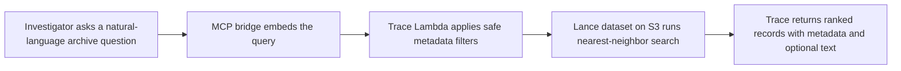

# Trace

Trace is an AI-assisted investigation workflow for cold archives. It helps
compliance and trust teams find, explain, and hand off the right evidence fast
even when exact keywords do not match.

Trace is purpose-built for one primary workflow: high-stakes archive review
across historical incidents, audits, and compliance records where language is
inconsistent but operational constraints still matter.

## Problem / User / Why Existing Search Fails / Why Trace

### Problem

Archived incident records are hard to turn into a defensible answer. The right
record may describe the same issue using different language, while
keyword-overlapping records can still be the wrong operational match.

### User

Trace is designed for a regulatory, compliance, or trust and safety
investigator who needs to answer questions like:

- Have we seen a related incident before?
- Are there matching cases in this city or document category?
- Which archived records are relevant enough to support an audit, regulator
  response, or internal escalation?
- Can I hand another team a defensible evidence packet instead of a loose list
  of search hits?

The primary persona is documented in
[docs/PERSONA.md](C:/Users/matth/Projects/Trace/Trace/docs/PERSONA.md).

### Why Existing Search Fails

- Keyword search is too brittle when prior records use different wording.
- Broad semantic search alone can still be too noisy for real investigations.
- Archive users need both flexible retrieval and strict operational narrowing.

### Why Trace

Trace combines semantic retrieval with constrained metadata filtering over
`city_code`, `doc_type`, `timestamp`, and `incident_id`. That lets
investigators start from a natural-language case request, tighten results to
the jurisdiction, document class, and time window that matter, and move toward
an explainable handoff instead of a generic search result page.

## Proof Of Value

The committed proof-of-value pack lives in
[docs/PROOF_OF_VALUE.md](C:/Users/matth/Projects/Trace/Trace/docs/PROOF_OF_VALUE.md).
It packages two selected local comparison artifacts from the retrieval harness:

- for the insurance lapse workflow, `keyword_only` returned `0/3` labeled positives while Trace returned `3/3`
- for the Chicago insurance-scope workflow, semantic-only retrieval kept `3/3` labeled positives but only `3/5` top rows stayed in scope, while Trace kept `5/5` in scope

Those two artifacts are the approved side-by-side comparisons for the README,
demo, and pitch. They are local retrieval evidence from the current eval corpus,
not proof of deployed-path equivalence or a broad benchmark. The same local
report also evaluates `vector_postfilter`; on the current labeled corpus it
matches `trace_prefilter_vector`, so the proof pack is intentionally showing two
selected failure modes rather than claiming that every non-Trace baseline loses.

For deployed Step 3 completion evidence, use
[docs/DEPLOYMENT_RUNBOOK.md](C:/Users/matth/Projects/Trace/Trace/docs/DEPLOYMENT_RUNBOOK.md)
and
[docs/deployed-proof-runbook.md](C:/Users/matth/Projects/Trace/Trace/docs/deployed-proof-runbook.md),
which define the required full proof run against `trace-eval`. In the manual
GitHub Actions entrypoint, only `run_purpose=release_gate` with empty
`case_ids` is gate-eligible; reduced-case reruns are smoke-only evidence.

## Evidence

The canonical Step 4 evidence pack lives in
[docs/BENCHMARK_EVIDENCE.md](C:/Users/matth/Projects/Trace/Trace/docs/BENCHMARK_EVIDENCE.md).
Use that doc and
[fixtures/eval/benchmark_evidence_snapshot.json](C:/Users/matth/Projects/Trace/Trace/fixtures/eval/benchmark_evidence_snapshot.json)
for README, demo, and pitch-safe numbers.

- Trace reached `1.000` average `Recall@k` and `1.000` filtered strict accuracy on the current labeled eval corpus.
- `keyword_only` lagged at `0.250` average `Recall@k`, `0.150` average `Precision@k`, and `0.000` filtered strict accuracy on that same corpus.
- the deployed `trace-eval` benchmark artifact now records warm HTTP median latency of `187.761` ms, median reported `took_ms` of `92.000` ms, direct-Lambda cold-sample median `Init Duration` of `97.480` ms plus median billed duration of `1728.000` ms, and estimated warm search-runtime cost of `0.00000164` USD/query

## At A Glance

The current repository contains:

- a production web app in `demo-ui/`
- a Node app API plus MCP bridge runtime in `mcp-bridge/`
- a Rust Lambda search engine in `lambda-engine/`
- a Python seeding pipeline in `scripts/`
- a deployed proof runner and MCP stdio helper in `scripts/`
- an AWS SAM template in `template.yaml`

The current implementation supports Lance-backed nearest-neighbor search,
constrained metadata filtering, API key or IAM-only HTTP access, and an MCP
bridge that embeds natural-language queries before calling the search API.

## How Trace Works



Trace is not generic search infrastructure. It is an investigation workflow
that balances semantic flexibility with structured control so operators can
reach a defensible decision faster.

## Production app architecture

The production app adds a browser-facing investigation surface on top of the
existing search stack:

- `demo-ui/` builds the static SPA that investigators use.
- `mcp-bridge/` now serves two roles: the existing stdio MCP bridge and the
  public app API Lambda runtime.
- The public app API is exposed under `/api/*` and owns embedding generation,
  typed filter handling, and result shaping for the frontend.
- The app API now resolves its OpenAI and optional Trace API secrets at Lambda
  runtime from Secrets Manager metadata env vars rather than asking
  CloudFormation to inject plaintext secrets directly.
- The Rust Lambda in `lambda-engine/` remains the search engine behind
  `POST /search`.

The browser should talk only to the app API. OpenAI credentials and any Trace
search API key stay server-side in the Node app API.

## Repository layout

- `demo-ui/`: static React/Vite frontend for the production investigation app
- `lambda-engine/`: Rust Lambda runtime, request validation, filtering, and Lance search path
- `mcp-bridge/`: shared Node layer for the stdio MCP bridge and the app API Lambda
- `scripts/`: synthetic dataset generation and optional S3 upload/promotion flow
- `docs/`: active reference docs plus a `deprecated/` archive for superseded planning material
- `template.yaml`: SAM deployment template for the Lambda and HTTP API

## Operator paths

Use the active docs this way:

- first-time search/eval setup, dataset refresh, stack rollout, deployed proof rerun entrypoint, and rollback: [docs/DEPLOYMENT_RUNBOOK.md](C:/Users/matth/Projects/Trace/Trace/docs/DEPLOYMENT_RUNBOOK.md)
- live browser app deploys, frontend publish, and app-specific smoke checks: [docs/WEB_APP_DEPLOYMENT.md](C:/Users/matth/Projects/Trace/Trace/docs/WEB_APP_DEPLOYMENT.md)
- deployed proof flags, acceptance rules, useful flags, and artifact review after you start from the deployment runbook: [docs/deployed-proof-runbook.md](C:/Users/matth/Projects/Trace/Trace/docs/deployed-proof-runbook.md)
- local retrieval relevance evaluation and metric interpretation: [docs/retrieval-eval-runbook.md](C:/Users/matth/Projects/Trace/Trace/docs/retrieval-eval-runbook.md)
- local OpenAI credential setup for embedding-backed workflows: [docs/OPENAI_API_KEY_SETUP.md](C:/Users/matth/Projects/Trace/Trace/docs/OPENAI_API_KEY_SETUP.md)

## Run the production app locally

Use this path when you want the React UI locally but still want the browser to
hit a deployed Trace app API.

1. Read `AppApiBaseUrl` from the deployed stack outputs and set
   `VITE_TRACE_API_BASE_URL` to that origin only, without an added `/api`
   suffix. The frontend app appends `/api/search`, `/api/cases`, and
   `/api/health` itself.

2. Run the frontend locally with Vite:

```bash
set VITE_TRACE_API_BASE_URL=https://<cloudfront-domain>
cd demo-ui
npm install
npm run dev
```

For app API packaging checks, frontend publishing, CloudFront invalidation, and
app-specific troubleshooting, use
[docs/WEB_APP_DEPLOYMENT.md](C:/Users/matth/Projects/Trace/Trace/docs/WEB_APP_DEPLOYMENT.md).
`sam local start-api` is not the supported `/api/*` workflow for this branch.

## Deploy the production app

Use
[docs/WEB_APP_DEPLOYMENT.md](C:/Users/matth/Projects/Trace/Trace/docs/WEB_APP_DEPLOYMENT.md)
as the canonical browser app deployment guide.

That guide owns:

- frontend-only deploys with `scripts/deploy-frontend.ps1`
- full-stack app deploys with `scripts/deploy-full.ps1`
- post-publish root, health, and `/api/search` smoke checks
- app-specific troubleshooting and emergency override guidance

Use
[docs/DEPLOYMENT_RUNBOOK.md](C:/Users/matth/Projects/Trace/Trace/docs/DEPLOYMENT_RUNBOOK.md)
for dataset generation, eval stack rollout, deployed proof rerun entrypoints, and rollback of
the search/eval environments.

## Quick start

Use the path that matches the job:

1. Set up a local OpenAI key for embedding-backed workflows:
   [docs/OPENAI_API_KEY_SETUP.md](C:/Users/matth/Projects/Trace/Trace/docs/OPENAI_API_KEY_SETUP.md)
2. Run the end-to-end search/eval operator flow:
   [docs/DEPLOYMENT_RUNBOOK.md](C:/Users/matth/Projects/Trace/Trace/docs/DEPLOYMENT_RUNBOOK.md)
3. Publish or update the browser app:
   [docs/WEB_APP_DEPLOYMENT.md](C:/Users/matth/Projects/Trace/Trace/docs/WEB_APP_DEPLOYMENT.md)
4. Run the local retrieval relevance harness:
   [docs/retrieval-eval-runbook.md](C:/Users/matth/Projects/Trace/Trace/docs/retrieval-eval-runbook.md)
5. Start deployed proof reruns in:
   [docs/DEPLOYMENT_RUNBOOK.md](C:/Users/matth/Projects/Trace/Trace/docs/DEPLOYMENT_RUNBOOK.md)
6. Use detailed proof acceptance and artifact review guidance from:
   [docs/deployed-proof-runbook.md](C:/Users/matth/Projects/Trace/Trace/docs/deployed-proof-runbook.md)

### Local component checks

```bash
cd lambda-engine
cargo test
```

```bash
cd mcp-bridge
npm install
npm run build
```

For detailed dataset generation, local validation, S3 promotion, and deployed
proof rerun entrypoints, use the deployment runbook instead of treating the README as
a second procedure guide.

## Runtime configuration

Important Lambda environment variables:

- `TRACE_LANCE_S3_URI`: canonical `s3://bucket/prefix` dataset location
- `TRACE_S3_BUCKET` and `TRACE_LANCE_PREFIX`: fallback pair if `TRACE_LANCE_S3_URI` is unset

When deployed with SAM (`template.yaml`), **`TraceDataBucketName`** and **`TraceLancePrefix`** populate all three variables and the S3 IAM policy together; override the prefix parameter (or pass it at deploy) to cut over to a new dataset location without code changes. Stack output **`TraceDatasetS3Uri`** reflects the resolved URI.
- `TRACE_QUERY_VECTOR_DIM`: expected embedding dimension, default `1536`
- `TRACE_MAX_PAYLOAD_BYTES`: request body limit, default `262144`
- `TRACE_API_KEY_SECRET`: optional HTTP API key secret; blank means IAM-only mode

Important MCP bridge environment variables:

- `TRACE_SEARCH_URL`: deployed HTTP search endpoint
- `OPENAI_API_KEY`: required for direct/local embedding calls unless `USE_MOCK_EMBEDDINGS=true`; the deployed app API can hydrate this at runtime from `OPENAI_API_KEY_SECRET_REF`
- `OPENAI_API_KEY_SECRET_REF`: deployed app API path for runtime secret lookup
- `OPENAI_API_KEY_SECRET_JSON_KEY`: optional JSON field name for runtime secret lookup; keep blank for the current plaintext secret convention
- `OPENAI_EMBEDDING_MODEL`: defaults to `text-embedding-3-small`
- `TRACE_QUERY_VECTOR_DIM`: optional cross-check against the embedding model dimension
- `TRACE_API_KEY_SECRET_REF`: optional deployed app API path for runtime Trace API key lookup
- `TRACE_API_KEY_SECRET_JSON_KEY`: optional JSON field name for runtime Trace API key lookup
- `TRACE_MCP_MOCK`: return mock search responses instead of calling the endpoint
- `USE_MOCK_EMBEDDINGS`: generate zero-vectors for local testing only

## Current behavior

- Search route: `POST /search`
- Transport: API Gateway HTTP API v2 or direct Lambda invoke
- Result limit: defaults to `10`, capped at `50`
- Metadata filter: constrained `sql_filter` grammar over `incident_id`, `timestamp`, `city_code`, and `doc_type`
- Text projection: `include_text: true` adds `text_content` to results

## Proof tooling

The repo includes deployed-proof tooling for end-to-end validation:

- `scripts/prove_deployed_path.py`: validates deployed `POST /search` and MCP traversal, supports `--case-ids` for reduced live smoke runs, supports `--replay-fixtures-dir` for CI-safe fixture replay, writes per-run artifacts, and can promote scrubbed stable fixtures
- `scripts/proof_mcp_stdio.py`: stdio JSON-RPC helper for exercising `mcp-bridge` as a subprocess from the proof runner
- `fixtures/deployed/golden_cases.json`: proof-oriented golden cases
- `fixtures/deployed/examples/`: committed location for stable scrubbed examples and replay fixtures; it now covers every golden case for full replay validation
- `.github/workflows/deployed-proof-replay.yml`: PR/main CI-safe replay of the full committed golden-case fixture set
- `.github/workflows/deployed-proof-live.yml`: manual live proof entrypoint with explicit `release_gate` vs `smoke_rerun` modes; it preflights `TraceApiKeySecretRef` from the selected stack and fails early if a required `TRACE_API_KEY` secret is missing

Use
[docs/DEPLOYMENT_RUNBOOK.md](C:/Users/matth/Projects/Trace/Trace/docs/DEPLOYMENT_RUNBOOK.md)
for the canonical deployed proof rerun entrypoint, then use
[docs/deployed-proof-runbook.md](C:/Users/matth/Projects/Trace/Trace/docs/deployed-proof-runbook.md)
for proof flags, acceptance rules, useful flags, and artifact review.

Current trusted proof context:

- the proof runner and tests are implemented
- replay mode now revalidates committed stable fixtures for every case in `fixtures/deployed/golden_cases.json`, covering unfiltered, equality-filtered, and simple `IN (...)` filtered proof paths without AWS or OpenAI access
- the current smoke dataset is `s3://trace-vault/uber_audit.lance/`
- the eval dataset is live at `s3://trace-vault/trace/eval/lance/`
- `trace-smoke` search URL: `https://u73d8vk2yl.execute-api.us-east-1.amazonaws.com/search`
- `trace-eval` search URL: `https://kqsqrljj11.execute-api.us-east-1.amazonaws.com/search`
- the first eval proof run passed and wrote artifacts under `artifacts/validation-runs/20260423T233528Z`
- representative stable fixtures are committed under `fixtures/deployed/examples/`

## Documentation map

- `docs/ARCHITECTURE.md`: component-level system overview
- `docs/API_CONTRACT.md`: request, response, auth, and filter grammar reference
- `docs/COMPETITION_STRATEGY.md`: rubric-optimized plan for maximizing Handshake x OpenAI Codex Creator Challenge scoring
- `docs/DATA_SPEC.md`: synthetic dataset schema and seed script behavior
- `docs/DEMO_PLAN.md`: recommended live-demo structure, memorable queries, and proof points
- `docs/DEPLOYMENT_RUNBOOK.md`: canonical search/eval operator path for dataset refresh, stack rollout, deployed proof rerun entrypoint, and rollback
- `docs/OPENAI_API_KEY_SETUP.md`: local embedding credential setup reference
- `docs/PERSONA.md`: primary user persona and product framing anchor
- `docs/deployed-proof-runbook.md`: proof flags, acceptance rules, useful flags, and artifact interpretation after starting from the deployment runbook
- `docs/PITCH_VIDEO_PLAN.md`: three-minute finalist pitch structure and asset checklist
- `docs/PROJECT_STATE.md`: current implementation snapshot
- `docs/NEXT_STEPS.md`: active prioritized backlog
- `docs/retrieval-eval-runbook.md`: local labeled relevance harness execution and metric interpretation
- `docs/S3_MIGRATION.md`: smoke-vs-eval dataset roles, prefix rules, and migration safety notes
- `docs/RUST_CRATE_DOCS.md`: external Rust dependency documentation index
- `docs/WEB_APP_DEPLOYMENT.md`: browser app publish, app smoke checks, and app-specific troubleshooting
- `docs/features/deployed-proof-path.md`: feature spec for the deployed proof-path implementation

Superseded planning docs and older README/state snapshots are preserved in `docs/deprecated/` with timestamped filenames.
